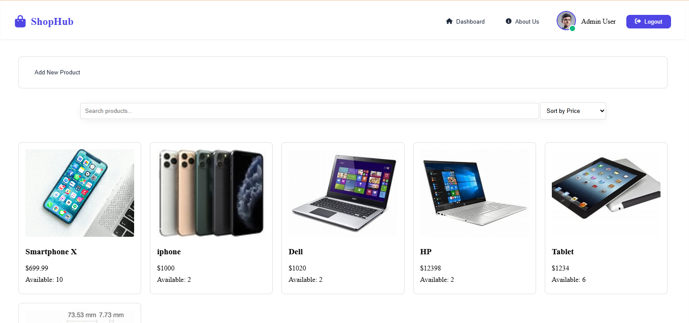
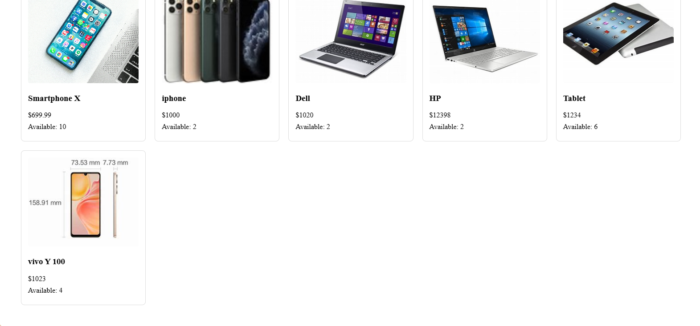
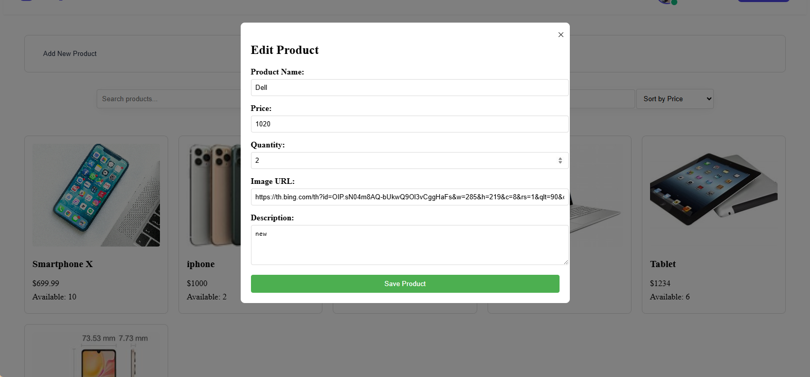
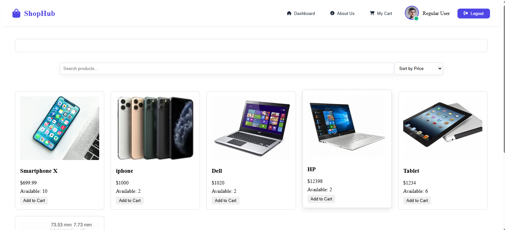

      <h1>  ShopHub</h1>
      <h3>Modern Shopping Experience</h3>

    
    
    

# 📌 Overview

A feature-rich e-commerce platform offering a seamless shopping experience. Built with modern web technologies, this system provides an intuitive interface for both customers and administrators.

# 🛠️ Tech Stack

## 🔴 Live Demo

Check out the live demo: [ShopHub](https://jamalihassan0307.github.io/Ecommerce-aa)

## 📸 Screenshots

### About Section

  
  
  
<em>Overview and company information</em>

### Admin Interface

#### Dashboard & Product Management

  
  
  
<em>Comprehensive admin control panel</em>

#### Product Operations

  
  
  
<em>Product management interface</em>

#### Admin Profile

  
  
<em>Administrator profile management</em>

### User Interface

  
  
  
<em>User dashboard and profile management</em>

## 🚀 Features

- **Shopping Cart**

  - Add/remove items
  - Quantity management
  - Price calculation
  - Save for later

- **User Authentication**

  - Secure login system
  - User profile management
  - Order history
  - Wishlist management

- **Product Management**

  - Product categories
  - Search functionality
  - Filtering options
  - Sort by price/popularity

- **Checkout System**
  - Multiple payment options
  - Address management
  - Order confirmation
  - Email notifications

## 🛠️ Built With

- **Frontend**

  - HTML5
  - CSS3
  - Vanilla JavaScript

- **Additional Features**
  - Responsive Design
  - Interactive UI
  - Cross-browser compatibility
  - Form validation

## 🤝 Contributing

Contributions, issues, and feature requests are welcome! Feel free to check [issues page](https://github.com/yourusername/your-repo-name/issues).

## 🙏 Acknowledgments

- [HTML5](https://developer.mozilla.org/en-US/docs/Web/HTML)
- [CSS3](https://developer.mozilla.org/en-US/docs/Web/CSS)
- [JavaScript](https://developer.mozilla.org/en-US/docs/Web/JavaScript)
